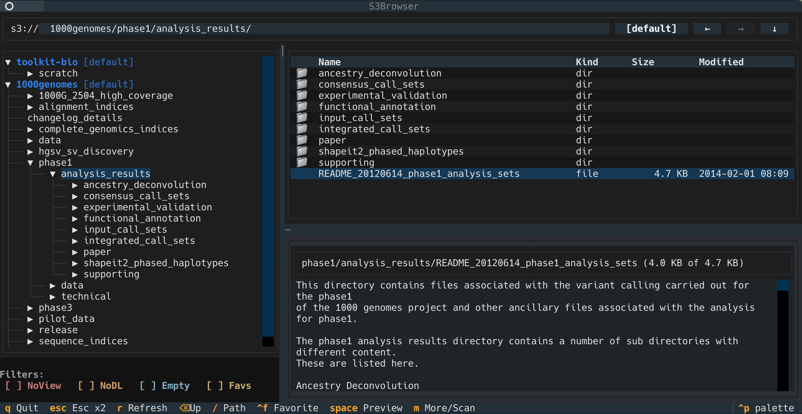

# awss3tui

`awss3tui` is a Textual terminal UI (TUI) and CLI helper for working with Amazon S3 across multiple AWS profiles.

It provides:
- An interactive S3 browser (`s3` with no subcommand)
- Lightweight wrappers for `aws s3 ls`, `aws s3 cp`, and `aws s3 sync`
- Automatic "best profile" detection for managing multiple roles to reduce profile/session friction




## Install

From PyPI:

```bash
pip3 install awss3tui
```

This installs the `s3` console script for the TUI and CLI helpers.

## Quick Start

Launch the TUI:

```bash
s3
```

Open directly to a bucket/prefix:

```bash
s3 s3://my-bucket/path/
# or
s3 my-bucket/path
```

Force a reindex (bypass cache on startup):

```bash
s3 reindex
```

See more:

```bash
s3 --help
```

## Requirements

- Python `>=3.10`
- AWS credentials/profiles configured (for example in `~/.aws/config`)
- AWS CLI available in `PATH` for:
  - `s3 login`
  - automatic SSO login flows from the TUI
  - `s3 generate-config`
  - wrapper subcommands (`ls`, `cp`, `sync`)

## Commands

### Browser mode (default)

When the first argument is not a known subcommand, `s3` treats it as TUI browse mode with optional startup path:

```bash
s3 [--profiles ...] [--profile ...] [--region ...] [path]
```

Notes:
- `path` may be `s3://bucket/prefix` or `bucket/prefix`.
- `browse` is accepted as an alias (`s3 browse ...`).

### `s3 reindex`

Same as browse mode, but forces a fresh bucket/permission refresh:

```bash
s3 reindex [--profiles ...] [--profile ...] [--region ...] [path]
```

### `s3 ls`

Wrapper around `aws s3 ls`:

```bash
s3 ls [path] [--dry-run] [any aws s3 ls options...]
```

Behavior:
- Adds `--human-readable` unless you already supplied it.
- Normalizes `path` to `s3://...` when needed.
- Unknown args are passed through to AWS CLI.
- `--dry-run` prints the resolved command and does not execute it.
- **auto-selects AWS profiles for s3 ls, s3 cp, and s3 sync** using its cached bucket-to-profile mapping, so you usually don’t need to pass --profile. If you do provide --profile, it is respected as an explicit override.

### `s3 cp`

Wrapper around `aws s3 cp`:

```bash
s3 cp <source> <destination> [--dry-run] [any aws s3 cp options...]
```

Behavior:
- Source/destination are normalized:
  - Local-like paths (`.`, `..`, absolute paths, `~/...`, Windows drive paths) stay local.
  - Non-local paths are treated as S3 and normalized to `s3://...`.
- `--dry-run` adds AWS CLI `--dryrun` unless already present, and still runs AWS CLI.
- Unknown args are passed through to AWS CLI.

### `s3 sync`

Wrapper around `aws s3 sync`:

```bash
s3 sync <source> <destination> [--dry-run] [any aws s3 sync options...]
```

Behavior matches `cp` path normalization and dry-run handling (`--dry-run` maps to AWS CLI `--dryrun`).

### `s3 login`

Runs AWS SSO login only for profiles that currently need reauthentication:

```bash
s3 login [--profiles dev,prod] [-p dev -p prod]
```

### `s3 generate-config`

Generates/merges AWS SSO role profiles and prints resulting config to stdout:

```bash
s3 generate-config [--sso-session SESSION]
```

Details:
- Reads AWS config (defaults to `~/.aws/config`, respects `AWS_CONFIG_FILE`).
- Reads SSO access tokens from `~/.aws/sso/cache`.
- Discovers accounts/roles via AWS SSO APIs.
- Creates/updates profile blocks with `sso_session`, `sso_account_id`, `sso_role_name`, `region=us-east-1`, and `output=json`.
- Rewrites existing profile `sso_session` references to canonical session names when equivalent sessions exist.
- Exits with guidance if no valid cached SSO token exists for a session.
- Writes merged config to stdout (it does not directly edit files for you).

## TUI Features

### Core UI

- Left pane: bucket/prefix tree.
- Right pane:
  - file explorer table (prefixes/objects)
  - preview panel
- Draggable split handles for pane resizing.

### Profile-aware bucket access

For each bucket, the app probes available profiles and picks the best effective profile:
- `good`: list + read object bytes
- `no_download`: list allowed but object read denied
- `no_view`: listing denied

You can manually switch profile per bucket from the profile button in the path bar.

### SSO handling

- Startup preflight checks for expired/near-expired SSO tokens and can run `aws sso login`.
- Runtime operations retry once after SSO reauth when token-expired errors are detected.
- In-flight reauth per profile is deduplicated.

### Preview and stats

- File preview loads first `4096` bytes, with `m`/More to fetch additional chunks.
- Folder preview shows immediate child stats.
- Press `m` on a folder preview to run recursive scan (up to `50,000` keys; reports partials when truncated).

### Download flows

- Download selected file(s) to chosen path.
- Download entire prefix recursively.
- Multi-select in table:
  - click: single select
  - Ctrl/Cmd-click: toggle
  - Shift-click: range select

### Favorites and filters

- Favorite a bucket with `Ctrl+F`.
- Toggle filters from the left pane:
  - hide `no_view`
  - hide `no_download`
  - hide empty buckets
  - show only favorites

## Keybindings

Global/app:
- `q`: quit immediately
- `Esc` twice within 1 second: confirm quit
- `r`: refresh buckets
- `Ctrl+L` or `/`: focus path input
- `Alt+Left` / `Alt+Right`: back/forward navigation history
- `Backspace`: go to parent prefix
- `Ctrl+F`: toggle favorite bucket
- `Space`: preview selected row
- `m`: preview more / recursive scan

Widget behaviors:
- Tree:
  - `Right`: move focus to table
- Table:
  - `Left`: move focus to tree
  - `Enter` on bucket/prefix: open
  - `Enter` on object: download
  - double-click on bucket/prefix: open
- Path input:
  - `Down`: move focus to table
  - `Enter`: navigate to typed path

## Local State and Cache

State is stored under:
- `${XDG_CONFIG_HOME:-~/.config}/awss/bucket-cache.json`
- `${XDG_CONFIG_HOME:-~/.config}/awss/config.json`

`bucket-cache.json` stores:
- resolved bucket -> profile mapping
- access classification
- empty-bucket flags
- save timestamp
- hash of `~/.aws/config` + `~/.aws/credentials`

Cache behavior:
- automatically reindexes every ~30 days
- invalidates immediately when AWS config/credentials hash changes
- startup may use cache first; `reindex` or `r` triggers live refresh
- if live refresh fails and cache exists, cached buckets can still be used

`config.json` stores:
- favorite buckets
- bucket filter toggles

## Development

Run tests:

```bash
python -m unittest discover -s tests -p "test_*.py"
```

Current suite covers CLI dispatch/wrappers, service logic, and headless Textual behavior.
